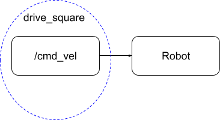

# CompRoboWarmup2023

### TELEOP 
For each behavior, describe the problem at a high-level. Include any relevant diagrams that help explain your approach. Discuss your strategy at a high-level and include any tricky decisions that had to be made to realize a successful implementation.

The teleop node controls the robot’s forward, backwards, left, and right movement. We wanted to use the W, A, S, and D keys or WASD keys on the computer keyboard as arrow keys since they are popular for gaming. We used W and S to control the linear x movement of the robot and A and S to control the angular velocity.

Our strategy at a high level was understanding the robots coordinate system. Once we had a good understanding of how it moved, we could send velocity commands using twist and publisher. We wanted clean movements so we set linear velocity to zero when it was turning and the angular velocity to zero when it was moving forward and backward. 

### DRIVE SQAURE
The drive square node commands the robot to draw a one meter square. The movement was hard coded based on speed and time. The robot moves forward 1 meter at a set speed for a set time then turns 90 degrees four times within a for loop. The time was calculated by dividing the distance or angle by the current speed. 

Distance / linear speed = time 
Angle / angular speed = time

A limitation of the time calculations is it assumes the robot goes from 0 to the set velocity instantaneously as opposed to accelerating up to the speed, thus the time calculation is slightly lower than the true time it takes to turn or move 1 meter. The time difference was noticeable in the 90 degrees turns, so we added an acceleration time that adds more time to allow the robot to complete the full turn. The acceleration time was calculated through trial and error. 

### WALL FOLLOWER
The wall follower node allows the robot to sense the wall nearest to its right, and drive parallel to it.
The node subscribes to the /scan topic to access the robot laser scan, and publishes to /cmd_vel. 
Our strategy was to have the robot look at the laser scanner message at both 45 and 135 degrees (relative to the robot's coordinate frame) in order to find how far away it is from the wall. Using trigonometry, the robot calculates the (x,y) coordinates of the wall vector relative to the robot, and shifts the vector over the robot plane. After calculating the difference between the angle of the wall and its own angle relative to the robot's frame, it rotates itself by the value to face a parallel path to the wall and rolls ahead indefinitely. 
The trickiest part of this implementation was trying to get our math to work. The robot has to calculate the vector of the wall in terms of coordinates, which requires trigonometry. We had to work out the math on paper before even attempting to code it, and even with the code we ran into many technical errors that combined logical, math mistakes and coding mistakes, which made it more difficult to debug. 

The primary limitation of this node is that it can only sense a wall to its left, and only two angles are used to sense the wall for the sake of the math used to determine the angle the robot must rotate. One of the angles is further behind the robot than the first angle, and should the wall be too short, behind the robot, it will fail to sense it correctly and make the calculations wrong.

### PERSON FOLLOWER
The person follower node allows the robot to sense the closest "person" within 3m of it, then turn/drive towards it. The node subscribes to the /scan topic to access the robot laser scan, and publishes to /cmd_vel to command the robot how to move.
The bot iterates through each angle of the lidar data, and saves only the angle of which the closest distance was scanned. Using this, the robot will gauge which side of the robot this closest object was, then begin to turn to face that direction. Once it senses that this closest object is in front of it, it will start to drive forwards.
The trickiest part of implementing this task was understanding how ROS timers and loops worked first, which helped to simplify the problem. When implementing this, we wanted to avoid calculating a “turn time” for the robot before commanding it to move. We realized after discussing with CA’s that a quick and easy solution for this problem was just a built-in part of ROS: if we just commanded the robot to turn endlessly, the object would eventually be in front of the robot, in which case the loop would reset and the robot would realize it could start going straight. 
The primary limitation of this node is that it cannot determine what is an object versus a person. It will simply follow any object that it senses with its laser scan. Additionally, it will only follow a “person” that is within 3 meters of it, rather than the “closest person” in general. This limitation was intentionally added to simplify the task; Limiting the robot’s “following” range helps it to avoid following unwanted objects such as walls or further objects. 

For each behavior, describe the problem at a high-level. Include any relevant diagrams that help explain your approach. Discuss your strategy at a high-level and include any tricky decisions that had to be made to realize a successful implementation.

### OBJECT AVOIDANCE
We implemented the object avoidance node for the robot to avoid any object that is within 5 meters of its front side. The node subscribes to the /scan topic to access the robot laser scan, and publishes to /cmd_vel to command the robot how to move. 
The bot was implemented similarly to person follower, but with a reversed behavior. The bot would sense if there was an object within 5 meters of the front side, specifically a 40 degree range about 0 degrees. Should it sense an object, it would then determine if the object was more towards its left or right (this can be determined given the angle saved is from 0-20 degrees, meaning the object is on its left, or 340-361 degrees, meaning the object is on its right). Depending on which side the object was more towards, the robot would turn towards its opposite direction until the object was out of its front sight. Only then would it continue driving forward. 
The trickiest part of implementing this was actually trying to determine the best way to implement this task. Because of the possible complexity this problem could have, we had to decide what is the best way to simplify this problem to a more solvable manner, and how much abstraction is still enough for the code to still technically do the task it was asked. 

### FINITE STATE CONTROLLER
The behavior of our finite state controller was to combine person follower and obstacle avoidance. The states were “predator” where it tried to reach the closest object and “prey” where it would try to run from the other objects. We combined the code by creating a state variable, and nesting each state’s code within an if statement that checks the state. The if statement is within the run loop and within the parse_scans methods since the different states used different techniques to read the lidar scan. We detected the transition between states when the robot is less than 0.3 meters away from its object. The initial inspiration behind the states was tag. 

### CODE STRUCTURE
 
### CHALLENGES
We faced multiple debugging challenges with the robot not interacting as we expected. Some common problems were forgetting to publish and not explicitly setting a robot’s speed at every set. 

### IMPROVEMENTS
We first wanted to complete the minimal viable product for each section before improving any one section. We would use odometry for the move square node as opposed to hard coding the movement. We ran into issues with the turn time calculation which could be solved using the robot’s odometry.

For the wall follower, we would improve the implementation to detect if the wall is on the left and the right. Our code currently only works if the wall is to the left of the robot. 
If we were to try to improve the obstacle avoidance, we would probably implement this similar to the gauntlet challenge in QEA3, by mapping objects surrounding the robot and giving each object a “weight” of importance dependent on its size and proximity. This would allow the robot an easier time of prioritizing and determining the most optimal path. 

### TAKEAWAYS
An important first step that should not be skipped is understanding the math and expected behavior of the robot before coding. Debugging was more efficient and successful when we could clearly see the differences between our expectations and the robot. In addition, print statements were extremely helpful for debugging. The project gave us a good foundation for exploring ros and various topics where we could communicate and control a neato. 
